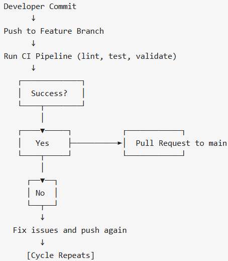

**Pull Request Workflow**  
Right now, we have a basic outline of how pull requests will work. Everyone will work on their own branch, and when a feature is ready, they will push it to the repository. Before merging, we’ll have pre-written tests for each feature to support test-driven development. These tests will run automatically in the CI pipeline. If all the tests pass, then you can make a pull request to the main branch. If the tests fail, you’ll have to fix the code and try again until everything passes and gets validated.

**Code Formatting with Prettier**  
To make sure all our code looks clean and consistent, we’re using Prettier, a VS Code extension that formats code automatically. Prettier helps fix things like indentation, spacing, commas, semicolons, and line wrapping. This, combined with clear and accurate naming conventions, will help keep our code easy to read and work with.

**Code Quality with ESLint and Codacy**  
For checking code quality, we’re using ESLint. ESLint helps us catch common mistakes and stick to good coding practices. For example, it prevents us from leaving unused variables in our code, which can cause confusion or bugs later. It also doesn’t allow using console.log statements in production code to keep things clean and professional. ESLint enforces the use of strict equality (===) instead of loose equality (==), which helps avoid unexpected type conversion errors. This tool will help keep code professional and clean so that anyone that looks at it can understand.  
Additionally, we added codacy to github actions so it automatically checks our code for quality issues. it looks for things like bad formatting, bugs, and other problems that could make the code messy or hard to maintain. every time we push or open a pull request, codacy runs and gives the code a grade, showing anything we should fix. it just helps us catch stuff early and make sure the code we merge into main is solid.

**GitHub branch protection**  
To make sure that someone that doesn't pass the test can merge to the main branch. Also you shouldn’t be allowed to merge your own changes without someone else looking at it. Also should prevent people from merging when there are merge conflicts.

**Documentation generation via automation using JSDoc**  
We used JSDoc to automatically generate documentation from comments in our JavaScript code. This helps keep our documentation accurate and up-to-date with minimal effort, making it easier for teammates to understand and use each other’s functions.

