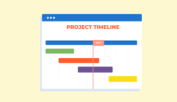

# Seekdeep-V2.1 Team Page

Welcome to the official team page for **Seekdeep-V2.1**, a cross-disciplinary group of passionate undergraduate students from **UC San Diego**. *Nice to meet you!*

---

## 🧑‍🚀 Who is Seekdeep?

We are a team of **11 developers** with roots across the world — from the United States 🇺🇸, China 🇨🇳, to Germany 🇩🇪. Our diversity drives creativity and brings unique perspectives to everything we build.

---

## Team 21 Roster

### Charlotte Kim  
- **Role**: Team Lead  
- **GitHub**: [@CharlotteKim123](https://github.com/CharlotteKim123)  
- *Skills*: 
- *Bio*: I am a third-year Computer Science and Engineering student, with a minor in Entrepreneurship and Innovation. I am looking forward to seeing what our team will achieve this quarter😄 

### Tommy Tran  
- **Role**: Team Lead  
- **GitHub**: [@ttran29](https://github.com/ttran29)  
- *Skills*: 
  
### Sophie Phung  
- **Role**: Developer  
- **GitHub**: [@sophiepng](https://github.com/sophiepng)  
- *Skills*: 
  
### Chester Huey  
- **Role**: Developer  
- **GitHub**: [@ChesterHuey](https://github.com/ChesterHuey)  
- *Skills*:  

### Darian Tan  
- **Role**: Developer  
- **GitHub**: [@darkotoni](https://github.com/darkotoni)  
- *Skills*: 

### Lisa Fritsche  
- **Role**: Developer  
- **GitHub**: [@lisafritsche](https://github.com/lisafritsche)  
- *Skills*:   

### Mohan Dong  
- **Role**: Developer  
- **GitHub**: [@TeslaAngel](https://github.com/TeslaAngel)  
- *Skills*: 

### Ryan Ni  
- **Role**: Developer  
- **GitHub**: [@ryunzz](https://github.com/ryunzz)  
- *Skills*: 

### Vijay Sinha  
- **Role**: Developer  
- **GitHub**: [@coderfreeze](https://github.com/coderfreeze)  
- *Skills*: 

### Akhil Subbarao  
- **Role**: Developer  
- **GitHub**: [@Jvaladeus](https://github.com/JvalaDeus)  
- *Skills*:  

### Edison Zhang  
- **Role**: Developer  
- **GitHub**: [@EdisonZhangUCSD](https://github.com/EdisonZhangUCSD)  
- *Skills*: FullStack Development, API Development, Databases, Debugging  

---

## Our Values

- **Strong Communication** – Respond (on time too)  
- **Integrity** – Do the work  
- **Collaboration** – Work together  
- **Respect** – Listen to each other and be patient with one another

---

## Our Culture & Inside Jokes

> "It’s not a bug it’s a feature"  
> "Time is just an illusion (this code took 40 hours and pure caffeine)"  
> "Unclear instructions … git push origin —delete master"  
> "It’s only confusing if you weren’t there at 3am when we ‘fixed’ it"  
> "Let us cook, they call it spaghetti code for a reason"  
> "Vibe coding only."  
> "Documentation is for the weak. We base it off the vibes."  
> "It’s not slow… it’s just pacing itself."
> "funny commit message:
> final_final_final_FINAL_PLEASEE"

---

## Project Timeline

*Here's a visual timeline representing the state of our project:*

---

## Schedule a Meeting

Need to catch up or discuss ideas? Schedule some time with us:  
[Schedule via Calendly](https://calendly.com/edisonzhangsw)

---

## Inspiration

In the wild world of code, every unexpected bug and caffeine-fueled all-nighter is a badge of honor. Embrace the chaos—each glitch is a stepping stone toward innovative breakthroughs. Remember, your unique quirks fuel creativity: what seems like spaghetti code today is the blueprint of tomorrow's solutions. So, when the code gets messy and the timelines feel stretched, let the humor in our late-night fixes and insane commit messages remind you that greatness is born out of persistence, passion, and a relentless drive to break the mold. Keep pushing, keep coding, and never forget—every line is a legacy in the making.

